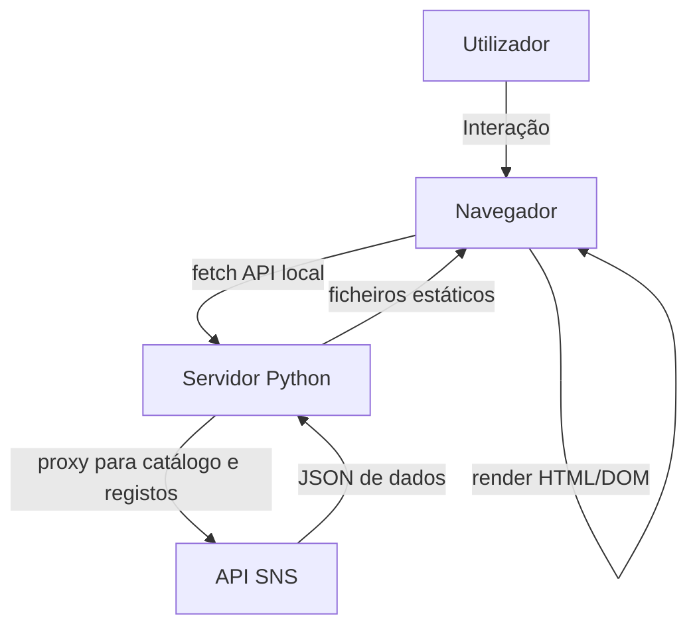

# Threat Model: Transparência SNS Cross-Analysis

## Executive summary
`server.py` funciona como proxy local e servidor estático para duas interfaces de análise (principal e cruzamentos), e consulta diretamente a API pública do portal SNS para construir um grafo de vínculos. O maior risco está em exibição de conteúdo de API em sinks HTML (`innerHTML`) na UI e em exposição pública ampla dos endpoints sem controles de origem, rate limiting e proteção de ficheiros estáticos. A superfície de risco é principalmente XSS de DOM e abuso de API por automação/DoS, não manipulação de credenciais, porque não há sessão/autenticação no produto atual.

## Scope and assumptions
- **In-scope:** `server.py`, `index.html`, `crosswalk.html`, `app.js`, `crosswalk.js`, `styles.css`, `README.md`, estrutura Git pública (`main` local).
- **Out-of-scope:** infra de deployment (IaaS/PaaS), browser extensions dos utilizadores e segurança da infra da `transparencia.sns.pt`.

### Assumptions
- O serviço pode correr em modo local (o código documenta `127.0.0.1:8000`) e também pode ser exposto como site público sem adaptação.
- Não existe autenticação de utilizador no backend atual.
- Os metadados/definições de campos fornecidos pela API de origem podem incluir conteúdo não esperado.

### Open questions
- O backend vai correr apenas localmente ou é planeado deploy público persistente?
- Existe ou existiu intenção de adicionar autenticação/quotas em produção?
- Estão disponíveis logs/alertas para monitorizar volume e erros da API local?

## System model
### Primary components
1. **Browser UI principal** (`index.html` + `app.js`)
2. **Browser UI cruzamentos** (`crosswalk.html` + `crosswalk.js`)
3. **Servidor local Python** (`server.py`) – `ThreadingHTTPServer`, endpoints `/api/*`, ficheiros estáticos.
4. **API de origem SNS** (`https://transparencia.sns.gov.pt/api/explore/v2.1`).

### Data flows and trust boundaries
- **Utilizador → Navegador:** interação de filtros, clique em nós e seleção de dataset; entradas não autenticadas.
- **Navegador → Servidor local:** chamadas `fetch` para `/api/analysis`, `/api/records/<dataset>`, `/api/dataset/<dataset>`, `/api/recent/<dataset>`.
  - Controlo atual: parsing básico de parâmetros e validação parcial de limites.
- **Servidor local → API SNS:** reencaminhamento de consultas para catálogo/registos em `server.py` (`_ods_fetch`).
  - Controlo atual: timeout HTTP 30s e cache local em memória.
- **Servidor local → Navegador (ficha estaticos):** serve `index.html`, `crosswalk.html`, JS/CSS via `SimpleHTTPRequestHandler`.
  - Controlo atual: sem diretório raiz dedicado, sem headers de hardening de segurança.
- **Navegador → DOM:** renderização de títulos/campos/chaves partilhadas via template strings e `innerHTML`.
  - Controlo atual: mistura de `textContent` e `innerHTML` (misto de segurança).

#### Diagram

## Assets and security objectives
| Asset | Why it matters | Security objective |
| --- | --- | --- |
| `server.py` API endpoints | Interface de agregação/cálculo usada por todas as páginas | Integridade (respostas consistentes), disponibilidade (evitar DoS), confidencialidade (se houver dados futuros sensíveis) |
| Cache em memória local | Evita chamadas repetidas à API e reduz latência | Integridade e disponibilidade |
| HTML/CSS/JS servidos localmente | Superfície de execução em browser do utilizador | Integridade do código e redução de XSS |
| Links entre datasets (`source`, `target`, `shared_fields`) | Núcleo da análise semântica | Integridade e veracidade | 
| Registos recentes (`/api/recent`) | Fonte de dados que passa para tabela | Integridade dos dados e desempenho |
| Estado da sessão UI (seleção/filtros) | Contexto de exploração | Disponibilidade e integridade (UX estável) |

## Attacker model
### Capabilities
- Atacante remoto consegue efetuar requisições HTTP públicas para endpoints disponíveis.
- Pode manipular o conteúdo mostrado no DOM (via fontes remotas se controladas ou comprometidas).
- Pode automatizar chamadas de API para sobrecarga.

### Non-capabilities
- Não há evidência de acesso privilegiado ao servidor da SNS ou às credenciais internas do projeto.
- Não há sessão autenticada persistente neste fluxo para serem roubadas por sessão hijack.

## Entry points and attack surfaces
| Surface | How reached | Trust boundary | Notes | Evidence |
| --- | --- | --- | --- | --- |
| `/api/analysis` | GET sem auth | Browser → servidor local | `min_score` é parseado sem validação robusta contra tipos extremos | `server.py:523-526` |
| `/api/records/<dataset_id>` | GET sem auth | Browser → servidor local | `limit` passa quase sem validação de teto | `server.py:562-573` |
| `/api/dataset/<dataset_id>` | GET sem auth | Browser → servidor local | `dataset_id` normalizado só com `quote()`, não há allowlist de formato | `server.py:550-557` |
| `/api/recent/<dataset_id>` | GET sem auth | Browser → servidor local | `limit` parseado como int sem teto explícito aqui | `server.py:579-586` |
| Render DOM em `app.js` | API → browser | Dados não íntegros entram no DOM | Muitos `innerHTML` com valores vindos da API | `app.js:227,275,390,493,549,561` |
| Render DOM em `crosswalk.js` | API → browser | Mesma superfície de DOM sink | `innerHTML` em células e texto de detalhes | `crosswalk.js:454,474,477,561,661` |
| Static file serving | HTTP GET | Servidor → ficheiros locais | Servidor baseado em diretório atual; sem allowlist | `server.py:480` |
| CORS headers | respostas HTTP | Browser de terceiros | `*` expõe respostas para qualquer origem | `server.py:482-483` |
| Scripts terceiros | HTML carregamento | Browser runtime | D3 via CDN sem integridade | `index.html:8` |

## Top abuse paths
1. **XSS de DOM por metadados do dataset**
   - Atacante com acesso para influenciar metadados (ou encadeamento via fornecedor comprometido) insere HTML malicioso.
   - Esse conteúdo entra em `innerHTML` na UI.
   - Impacto: execução de JS no navegador do analista e exfiltração de estado local.

2. **Abuso de parâmetros para sobrecarga**
   - Atacante dispara pedidos em massa para `/api/records/<dataset>?limit=999999` ou variação de limites.
   - Impacto: chamadas simultâneas e respostas volumosas da API externa, latência e indisponibilidade local.

3. **Exploração de caminho de dataset**
   - Atacante chama endpoint com `dataset_id` contendo separadores ou codificação ambígua.
   - `quote()` não está com `safe=""`, pode manter `/`, alterando rota destino.
   - Impacto: consulta de paths não previstas e possível exposição de informação externa/acoplada.

4. **Consumo de recursos por scraping público**
   - Com CORS aberto e ausência de rate limit, qualquer origem pode consultar `/api/analysis`/`/api/recent`.
   - Impacto: egress descontrolado e esgotamento do backend local.

5. **Levantamento de ficheiros locais**
   - Se o serviço estiver publicado com o diretório atual do repo, ficheiros sensíveis em cwd podem ser servidos.
   - Impacto: exposição de `.git`, configurações e arquivos de trabalho não destinados ao público.

## Threat model table
| Threat ID | Threat source | Prerequisites | Threat action | Impact | Impacted assets | Existing controls (evidence) | Gaps | Recommended mitigations | Detection ideas | Likelihood | Impact severity | Priority |
| --- | --- | --- | --- | --- | --- | --- | --- | --- | --- | --- | --- |
| TM-001 | Browser attacker / third-party site | API metadata com conteúdo não confiável | DOM XSS via `innerHTML` nas listas de ligações e detalhes | Execução de script no browser da vítima | `app.js` render, estado UI | `textContent` usado em parte do UI (`themeFilter`, títulos etc.) | múltiplos sinks `innerHTML` com campos de origem remota | substituir por `textContent`, usar DOM APIs seguras, sanitizer para campos HTML, adicionar CSP | CSP report/canário de erro JS, CSP reporturi (se disponível), audit no console por injeções | Médio | High | High |
| TM-002 | Browser attacker / malformed remote metadata | API retorna campos com HTML/JS | Similar XSS em `crosswalk.js` (`pairTable`, `crossPaths`, `crossDetail`) | Compromisso da sessão do browser, modificação UI, exfiltração | `crosswalk.js` | alguns valores de texto usam `textContent` | `innerHTML` em células e detalhes sem escape (`crosswalk.js:470-475`, `561`, `661`) | sanitize/escape, evitar interpolação direta; manter `formatCell` como texto puro | testes e2e com payload `` na resposta simulada | Médio | High | High |
| TM-003 | Script de origem externa (site malicioso) | Servidor local publicamente acessível | CORS permissivo permite leitura por qualquer origem | Exposição de dados analíticos e automação cross-site não autorizada | endpoints API | apenas GET + CORS mínimo | `Access-Control-Allow-Origin: *` sem allowlist | definir origem permitida e `Vary: Origin`, remover cabeçalho se não necessário | logs de origem com rejeições, monitorização de User-Agent anómalos | Alto | Medium | High |
| TM-004 | Remote user sem limite de taxa | Endpoint sem throttling | Requisições repetidas a `/api/analysis` e `/api/records` | Saturação da API local e da origem SNS | `server.py`, cache, thread pool implícito | cache TTL e limite de entradas | sem limite por IP/rota e sem quotas | token bucket simples, limite de requests por 5s, cache de negativos e backoff no erro | métricas de 429, latência, filas de conexão | Alto | High | High |
| TM-005 | Malicious caller | Endpoint `/api/dataset/<id>` e `/api/records/<id>` | Path injection parcial e rotas internas inesperadas | Consulta de recurso interno de API não pretendido e bypass de análise | `server.py` e ODS API | `unquote` e `int` cast, cap em partes de lógica | quote padrão com `/` permitido e pouca validação de `dataset_id` | validar `dataset_id` com regex (`^[a-zA-Z0-9._-]+$`), `quote(..., safe="")`, recusar entradas largas | alerta em 404 inesperados e picos por id inválido | Médio | Medium | Medium |
| TM-006 | Atacante com acesso a origem de deploy | Servidor mal configurado em folder root | `SimpleHTTPRequestHandler` expõe ficheiros não públicos | Divulgação de ficheiros internos e metadados | diretório do projeto | nenhum isolamento de raiz documentado | nenhum `DocumentRoot` dedicado, sem deny list explícita | restringir diretório estático e validar path, usar WSGI/Proxy reverso com ACL | varredura de path (`/.git`, `/.env`) e 404 policy | Médio | Medium | Medium |
| TM-007 | Usuário sem controlo de infra | Deploy direto em produção | Sem headers de segurança em resposta HTTP | Aumento de impacto de XSS/injeção por exploração de terceiros | respostas HTTP do servidor local | `Cache-Control` e CORS apenas | ausência de CSP, X-Content-Type-Options, frame options | implementar header hardening e `Referrer-Policy` | monitorizar CSP report-uri / bloqueios de navegador | Médio | Medium | Medium |
| TM-008 | Cliente/operador | Crescimento do catálogo | Pipeline `O(n^2)` para `links` sem paginar | Consumo elevado de CPU/memória sob muitos datasets | processos de análise | cache de resultados | limite de saída rígido e paginação para análise incremental | limitar pares gerados por top-k, worker assíncrono, cache por `min_score` | monitorizar duração média e uso de RAM | Médio | Medium | Medium |

## Criticality calibration
- **Crítico:** perda de integridade da sessão do browser com execução remota (XSS confirmável com origem controlada).
- **Alto:** exposição pública sem rate limiting ou CORS mal configurado com potencial de DoS consistente.
- **Médio:** exposição de assets não sensíveis e falta de hardening HTTP.
- **Baixo:** falhas de robustez de input (ex.: parâmetros fora de range) sem impacto direto imediato.

## Focus paths for security review
| Path | Why it matters | Related Threat IDs |
| --- | --- | --- |
| `server.py:480-601` | API local, roteamento, headers e controle de origem | TM-003, TM-004, TM-005, TM-006, TM-007 |
| `app.js:190-713` | Renderização principal e árvore de cruzamentos com múltiplos sinks | TM-001, TM-008 |
| `crosswalk.js:150-713` | Renderização detalhada de pares/caminhos com HTML dinâmico | TM-002 |
| `index.html:1-130` | Dependências e scripts externos sem SRI | TM-007 |
| `crosswalk.html:1-120` | Fluxo alternativo com mesmos dados e riscos de DOM sinks | TM-002 |

## Notes on use
- Foco inicial recomendado: TM-001 e TM-002 (alto impacto no browser), TM-004 (estabilidade do serviço) e TM-006 (publicação).
- Para validação final, confirmar se existe deploy público e qual origem de terceiros pode carregar o site.
