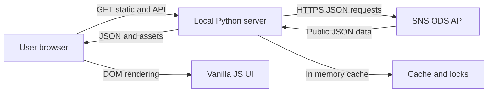

# Threat Model: transparencia_connect

## Executive summary
O projeto é um explorador local-first em Python `http.server` + frontend vanilla JS que serve páginas estáticas e expõe endpoints `/api/*` para consultar e analisar a API pública do Portal Transparência SNS. O risco principal não é autenticação ou segredos, porque não há login nem credenciais no código; é disponibilidade e abuso de endpoints analíticos caros se o serviço for exposto fora de `127.0.0.1`, mais integridade/confiança da UI ao renderizar dados vindos de uma API externa. A postura atual é razoável para uso local, mas ainda não deve ser tratada como perfil de produção pública.

## Scope and assumptions
- In-scope paths: `server.py`, `index.html`, `analytics.html`, `crosswalk.html`, `research.html`, `app.js`, `analytics.js`, `crosswalk.js`, `research.js`, `styles.css`, `scripts/`, `tests/`.
- Out-of-scope: infraestrutura de produção, reverse proxy, TLS, gestão de DNS, segurança da API `transparencia.sns.gov.pt`, extensões do browser do utilizador.
- Assumption: o modo suportado é local em `127.0.0.1:8000`, conforme `server.py:3701` e `README.md`.
- Assumption: os dados são públicos/agregados, mas podem conter metadados inesperados; dados clínicos identificáveis não devem ser usados nesta aplicação.
- Assumption: não há multi-tenant nem autenticação; qualquer pessoa com acesso ao processo local pode consultar os endpoints.

Open questions that change risk ranking:
- Vai haver deploy público persistente ou continuará estritamente local?
- O serviço ficará atrás de reverse proxy com rate limiting/logs, ou diretamente exposto?
- Há intenção de processar dados internos, identificáveis ou semi-identificáveis no futuro?

## System model
### Primary components
- Python local server: `TransparenciaHandler` em `server.py`, baseado em `ThreadingHTTPServer` e `SimpleHTTPRequestHandler`.
- API proxy/analytics layer: endpoints `/api/analysis`, `/api/analytics`, `/api/data-analytics`, `/api/finprod`, `/api/deep-research`, `/api/recent`, `/api/records`, `/api/dataset`.
- Static frontend: HTML/CSS/JS vanilla com D3 externo em `index.html`.
- Upstream: API pública Opendatasoft/SNS em `ODS_BASE`.
- In-memory state: cache `_cache`, locks `_fetch_locks`, rate-limit map `_rate_limit_hits`.

### Data flows and trust boundaries
- Browser -> local server: HTTP GET/OPTIONS, no auth, parameters such as `dataset_id`, `limit`, `min_score`; validation via `_parse_dataset_id` and `_parse_int_param`.
- Local server -> upstream SNS API: HTTPS via `urllib.request.urlopen`; fixed base URL `ODS_BASE`; dataset path constructed with `quote(dataset_id)` and query via `urlencode`.
- Upstream SNS API -> local server: JSON catalog/records; parsed with `json.loads`; cached in memory with bounded size.
- Local server -> browser: JSON API responses and static assets; security headers in `_set_security_headers`.
- API data -> DOM: frontend uses DOM APIs in reviewed app files; QA now blocks common dangerous sinks.

#### Diagram

## Assets and security objectives
| Asset | Why it matters | Security objective (C/I/A) |
| --- | --- | --- |
| Local server process | Handles all API and static requests | A/I |
| Upstream API availability | App depends on external SNS data | A |
| Cache contents | Holds catalog/analysis payloads and can affect UI correctness | I/A |
| Frontend JS/HTML | Runs with page origin privileges | I |
| Public datasets and records | Public but can be misunderstood or overexposed through future internal use | C/I |
| Analytics methodology outputs | Drives user interpretation and decisions | I |
| Local logs | May reveal upstream paths/status and operational behavior | C/I |

## Attacker model
### Capabilities
- Can send unauthenticated HTTP GET/OPTIONS to the local server if reachable on their network.
- Can vary query parameters and dataset IDs within validation rules.
- Can trigger expensive analytics endpoints repeatedly until rate limiting applies.
- Can influence displayed content only if upstream public metadata/records are compromised or unexpectedly contain hostile strings.

### Non-capabilities
- No repository evidence of secrets, credentials, user sessions, write APIs, uploads, database writes, subprocess execution, `eval`, or authenticated admin actions.
- If bound only to `127.0.0.1`, a remote internet attacker cannot directly reach the service without local compromise or browser-mediated access.

## Entry points and attack surfaces
| Surface | How reached | Trust boundary | Notes | Evidence |
| --- | --- | --- | --- | --- |
| Static files | `GET /`, `/*.html`, JS/CSS/assets | Browser -> local server | Allowlist protects against directory traversal and report leakage | `server.py:322`, `server.py:3683` |
| `/api/analysis` and `/api/analytics` | GET with `min_score` | Browser -> analytics | Catalog-wide computation, cached | `server.py:3467`, `server.py:3595` |
| `/api/data-analytics` | GET with `dataset_id`, `limit` | Browser -> analytics | Pulls and analyzes records sample | `server.py:3487` |
| `/api/finprod` and recommendations | GET with two dataset IDs | Browser -> analytics | Cross-analysis can call multiple sampled datasets | `server.py:3502`, `server.py:3539` |
| `/api/deep-research` | GET with `dataset_id`, `limit` | Browser -> analytics | Copies analytics payload and derives feature screening/map | `server.py:3567` |
| `/api/dataset`, `/api/records`, `/api/recent` | GET path param dataset ID | Browser -> upstream proxy | Dataset ID regex and limits reduce route abuse | `server.py:3641`, `server.py:3653`, `server.py:3671` |
| CORS | `Origin` header | Other origins -> local API | Allowlist only for localhost/127.0.0.1 variants | `server.py:486`, `server.py:3361` |
| Frontend rendering | API JSON -> DOM | Upstream data -> browser | Safe DOM APIs in reviewed app files; QA now blocks common dangerous sinks | `analytics.js`, `scripts/qa.py` |
| Third-party JS | CDN D3 load | jsDelivr -> browser | Pinned version with SRI | `index.html:9` |

## Top abuse paths
1. **Local DoS through expensive analytics endpoints**
   1. Attacker reaches the local server over network or compromised browser context.
   2. Repeatedly requests `/api/deep-research`, `/api/finprod/recommendations`, `/api/data-analytics` with varied datasets.
   3. Threading server opens concurrent work and upstream calls until rate limit/cache reduce impact.
   4. Impact: degraded local UI and unnecessary upstream load.

2. **Public deployment without production edge controls**
   1. Operator exposes the current `ThreadingHTTPServer` beyond localhost.
   2. Anonymous users use all endpoints with no auth or quota beyond per-IP in-process rate limit.
   3. Impact: noisy scraping, unreliable availability, weak operational observability.

3. **Upstream metadata/record content misleads or stresses frontend rendering**
   1. Upstream data includes unusually long or hostile strings.
   2. UI renders text safely in most places, but layout/interpretation can still be degraded.
   3. Impact: UI integrity/reliability issue; XSS likelihood is low because dangerous sinks are not used for API-derived content in observed paths.

4. **CSP weakened by inline style allowance**
   1. If a DOM injection bug is introduced later, `style-src 'unsafe-inline'` gives less protection against UI redressing/style injection.
   2. Current script execution remains constrained by `script-src 'self' https://cdn.jsdelivr.net`.
   3. Impact: defense-in-depth gap, not an active exploit by itself.

5. **CORS confusion in local context**
   1. A malicious local-origin page may receive CORS approval if it matches allowlisted localhost variants.
   2. It can read public API outputs from the local service.
   3. Impact: low for public data, higher if future endpoints expose internal/private data.

6. **Cache poisoning by trusted-but-wrong upstream/fallback data**
   1. Upstream returns malformed but valid JSON or stale data is reused.
   2. Cache serves it to users for the TTL or stale fallback path.
   3. Impact: integrity of analytics/interpretation, not code execution.

## Threat model table
| Threat ID | Threat source | Prerequisites | Threat action | Impact | Impacted assets | Existing controls (evidence) | Gaps | Recommended mitigations | Detection ideas | Likelihood | Impact severity | Priority |
| --- | --- | --- | --- | --- | --- | --- | --- | --- | --- | --- | --- | --- |
| TM-001 | Anonymous local/network caller | Service reachable beyond trusted localhost or browser-mediated local requests possible | Repeatedly invoke costly analytics routes | UI/server degradation and upstream API pressure | Server availability, upstream quota/goodwill | Per-IP rate limit, route-specific expensive endpoint limit, bounded concurrent expensive request semaphore, cache caps and request timeouts | ThreadingHTTPServer and rate limits are still in-process only | Add production edge limits if public; add tests for expensive route throttling; document non-production server profile | Count 429s/503s, endpoint latency, concurrent requests, upstream error rates | Medium | Medium | Medium |
| TM-002 | Operator/deployer mistake | Current local server exposed publicly | Use no-auth API as public analytics proxy | Scraping, DoS, unexpected public data service | Availability, reputation | Binds to `127.0.0.1`; static allowlist; security headers | No production auth/edge quota/deployment guard | Keep bind local by default; if public, deploy behind reverse proxy with TLS, request limits, logging, optional auth | Alert if server starts on non-loopback; proxy access logs | Medium if public, Low if local | Medium | Medium |
| TM-003 | Malicious/compromised upstream data | API metadata/records contain hostile strings | Attempt DOM XSS or visual manipulation | Browser compromise if unsafe sinks are introduced; current impact mostly UI confusion | Frontend integrity | Rendering uses DOM APIs in reviewed files; QA blocks common dangerous sinks; CSP blocks inline scripts; no eval found | No Trusted Types; CSP still has inline styles | Keep QA sink scan; consider Trusted Types later; keep API-derived data out of HTML sinks | Browser tests with `` payloads in mocked API | Low | High if exploitable | Medium |
| TM-004 | Malicious site on same machine/origin pattern | Victim has local server running and hostile page from allowlisted localhost origin | Read local API outputs via CORS | Public data exposure; future private data risk | API outputs | `_normalize_origin` only allows localhost/127.0.0.1 | Localhost origins are broad; future private endpoints would be exposed to other local apps | For sensitive future data, require per-run random token or disable CORS entirely unless needed | Log Origin, reject unexpected ports if not needed | Low now | Medium future | Low |
| TM-005 | Upstream/API failure or stale data | SNS API down or returns stale/malformed data | App serves fallback/stale outputs as if available | Incorrect analysis decisions | Analytics integrity | Fallback flags and warnings propagated; cache metadata included | Users may still over-trust stale/fallback views | Keep persistent fallback banners; add generated_at/source freshness to every analytical page | Monitor fallback/degraded status frequency | Medium | Medium | Medium |
| TM-006 | Supply-chain compromise | CDN or dependency path compromised and SRI bypass/updated incorrectly | Execute modified D3 in page origin | Browser-side compromise | Frontend integrity | D3 is pinned with SHA-384 SRI and CSP source restricted | CDN still allowed in CSP; operational dependency on third party | Vendor D3 locally if public deployment matters; remove CDN from CSP | CSP violation logs, dependency review | Low | High | Low |
| TM-007 | Local user or scanner | Requests unknown/static paths | Attempt path traversal or dotfile access | File disclosure if allowlist fails | Repo files | `ALLOWED_STATIC_PATHS`, directory listing disabled | Error message reflects requested path in JSON | Keep allowlist; make 404 generic if exposed publicly | Track 404 path scans | Low | Medium | Low |

## Criticality calibration
- Critical: any pre-auth RCE, file read outside allowlist, or confirmed DOM XSS from public upstream data that executes script under app origin.
- High: public deployment enabling sustained unauthenticated DoS, private/internal data exposure, or removal of static allowlist/CSP.
- Medium: expensive unauthenticated computation, stale/fallback integrity issues, CORS risk that becomes serious if future private data is added.
- Low: local-only information leakage, broad image/style policy, CDN dependency with SRI.

## Focus paths for security review
| Path | Why it matters | Related Threat IDs |
| --- | --- | --- |
| `server.py` | All routing, proxying, cache, rate limit, headers and loopback binding live here | TM-001, TM-002, TM-004, TM-005, TM-007 |
| `analytics.js` | Largest frontend surface, export flow and heavy analytics rendering | TM-003 |
| `app.js` | Main catalog UI and recent records rendering from upstream data | TM-003 |
| `crosswalk.js` | Complex relation rendering and JSON export | TM-003 |
| `research.js` | Deep-research page reads dataset ID from URL and requests `/api/deep-research` | TM-001, TM-003 |
| `index.html` | Third-party D3 dependency and SRI/CSP compatibility | TM-006 |
| `scripts/browser_smoke.js` | Browser smoke coverage should include security regression payloads | TM-003 |
| `tests/` | Best place to lock route validation, rate limits and cache/fallback behavior | TM-001, TM-005, TM-007 |

## Quality check
- Covered discovered runtime entry points: static routes and all visible `/api/*` handlers.
- Covered trust boundaries: browser/local server, local server/upstream, upstream data/DOM, CDN/browser.
- Separated runtime from dev/tests: tests and scripts are review paths, not runtime surfaces.
- User clarifications not yet provided: deployment model and future data sensitivity remain assumptions.
- No secrets were printed or found during this review.
